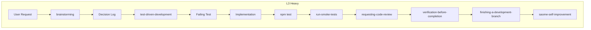

# SAOME Methodology Bridge

> **2026-07-29 更新**：BDD（Cucumber）已廢除。單人 vibe coding 場景下，vibe prompt 即 BDD。

## 目的

L3 Heavy 任務的觸發時機與資料流向定義。

## Task Router 分流表

| 等級 | 觸發條件 | 工作流程深度 |
|------|----------|--------------|
| **L1 Trivial** | 改 UI 元件屬性 / 修 typo / 改文案 | 直接做 → lint → test |
| **L2 Standard** | 新 L1/L2 元件 / 一般 bug fix | TDD → Verification |
| **L3 Heavy** | 新功能涉及多模組 / 架構改動 / 跨 package 變更 | Brainstorming → Decision Log → TDD → Review → Smoke |
| **L3 Escape Hatch** | L3 Heavy 但需求模糊 / 跨系統整合 / Breaking change | L3 Heavy + Spec-Kit 完整流程 |

詳見 `.cursor/skills/saome-task-router/SKILL.md`。

## L3 Heavy 完整流程



## 完整資料流向（L3 Heavy）

```
User Request
    ↓
brainstorming (Superpowers) → 確認需求
    ↓
Decision Log → runs/decisions/YYYY-MM-DD-<topic>.md
    ↓
test-driven-development (Superpowers) → 寫 failing test (TDD 入口)
    ↓
Implementation → 實作代碼
    ↓
npm test → 驗證單元測試
    ↓
run-smoke-tests (Superpowers) → 冒煙測試
    ↓
requesting-code-review (Superpowers) → Code Review
    ↓
verification-before-completion (Superpowers) → 最終驗證
    ↓
finishing-a-development-branch (Superpowers) → 完成分支
    ↓
saome-self-improvement (SAOME) → 流程反省
    ↓
完成
```

## L3 Heavy Skill 觸發矩陣

| 環節 | Skill | 必須/可選 |
|------|-------|-----------|
| Task Router | `saome-task-router` | **必須** |
| 創意發想 | `superpowers:brainstorming` | **必須** |
| Decision Log | 手動寫 `runs/decisions/` | **必須** |
| TDD 實作 | `superpowers:test-driven-development` | **必須** |
| 冒煙測試 | `superpowers:run-smoke-tests` | **必須** |
| Code Review | `superpowers:requesting-code-review` | **必須** |
| 最終驗證 | `superpowers:verification-before-completion` | **必須** |
| 完成分支 | `superpowers:finishing-a-development-branch` | **必須** |
| 流程反省 | `saome-self-improvement` | **必須** |

## 觸發關鍵字對照表

| 關鍵字 | task-router 等級 |
|--------|----------------|
| 改 UI、切版、修 typo | L1 Trivial |
| 新增、元件、fix | L2 Standard |
| 新功能、加功能、做頁面 | L3 Heavy |
| 修 bug、修復、fix | L2 Standard |
| 改 UI、切版、rwd | L1 Trivial |
| 加業務邏輯 | L3 Heavy |
| 重構、refactor | L2/L3 Heavy（視複雜度） |
| L1 元件、UI 元件 | L2 Standard |
| L2 元件、業務元件 | L3 Heavy |
| deploy、部署、上線 | Smoke Test |
| 平台整合、BREAKING | L3 Escape Hatch |

## 觸發時機速查

### L1 Trivial（直接做）

- 改 UI 元件屬性（variant、size 等）
- 修 typo
- 改文案
- 加一行 console.log

### L2 Standard（TDD）

- 新增 L1 UI 元件
- 新增 L2 業務元件
- 一般 bug fix
- 小重構

### L3 Heavy（完整流程）

- 新功能涉及多模組
- 架構改動
- 跨 package 變更
- 新 API endpoint
- 商業邏輯變更

### L3 Escape Hatch（Spec-Kit + L3 Heavy）

- 需求含糊（「做個好看的按鈕」）
- 跨系統整合
- Breaking change
- 平台遷移

## 參照

- `saome-task-router/SKILL.md` — 任務級距分流器
- `001-methodology.mdc` — 方法論總覽
- `003-tdd-integration.mdc` — TDD 整合
- `004-code-review.mdc` — Code Review
- `005-smoke-test.mdc` — Smoke Test
