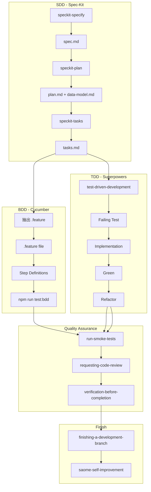

# SAOME Methodology Bridge

> 統一 SDD（Spec-Kit）、BDD（Cucumber）、TDD（Superpowers）三種方法論的觸發時機、資料流向、產出物定義。

## 目的

1. **統一觸發時機** — 何時使用哪個 skill
2. **定義資料流向** — spec → feature → test → implementation
3. **消除流程斷層** — 確保每個環節都有對應工具支援

## 三系統交互圖



## 完整資料流向

```
User Request
    ↓
brainstorming (Superpowers) → 確認需求
    ↓
speckit-specify → spec.md (SDD 入口)
    ↓
speckit-clarify → 澄清模糊點（可選）
    ↓
speckit-plan → plan.md, data-model.md
    ↓
speckit-tasks → tasks.md
    ↓
speckit-analyze → 驗證一致性（可選）
    ↓
抽出 .feature → .specify/memory/specs/features/*.feature (BDD 入口)
    ↓
寫 Step Definitions → packages/shared/bdd/steps/
    ↓
npm run test:bdd → 驗證 BDD 行為
    ↓
test-driven-development (Superpowers) → 寫 failing test (TDD 入口)
    ↓
Implementation → 實作代碼
    ↓
npm test → 驗證單元測試
    ↓
run-smoke-tests (Superpowers) → 冒煙測試
    ↓
requesting-code-review (Superpowers) → Code Review
    ↓
verification-before-completion (Superpowers) → 最終驗證
    ↓
finishing-a-development-branch (Superpowers) → 完成分支
    ↓
saome-self-improvement (SAOME) → 流程反省
    ↓
完成
```

## 完整 Skill 觸發矩陣

| 環節 | Skill | 必須/可選 |
|------|-------|-----------|
| 創意發想 | `superpowers:brainstorming` | 必須 |
| 需求澄清 | `speckit-specify` | 必須 |
| 模糊點澄清 | `speckit-clarify` | 可選 |
| 技術規劃 | `speckit-plan` | 必須 |
| 任務分解 | `speckit-tasks` | 必須 |
| 一致性驗證 | `speckit-analyze` | 可選 |
| BDD 行為 | 手動 + `002-bdd.mdc` | 必須 |
| TDD 實作 | `superpowers:test-driven-development` | 必須 |
| 冒煙測試 | `superpowers:run-smoke-tests` | 必須 |
| Code Review | `superpowers:requesting-code-review` | 必須 |
| 最終驗證 | `superpowers:verification-before-completion` | 必須 |
| 完成分支 | `superpowers:finishing-a-development-branch` | 必須 |
| 流程反省 | `saome-self-improvement` | 必須 |

## 觸發關鍵字對照表

| 關鍵字 | 觸發流程 | 使用的 Skills |
|--------|----------|---------------|
| 「新功能」「加功能」「做頁面」 | SDD+BDD+TDD+Review | brainstorming, speckit-specify, test-driven-development, run-smoke-tests, requesting-code-review |
| 「修 bug」「修復」「fix」 | TDD+Review | test-driven-development, requesting-code-review |
| 「改 UI」「切版」「rwd」 | TDD+RWD+Review | test-driven-development, requesting-code-review |
| 「加業務邏輯」 | SDD+BDD+TDD+Review | brainstorming, speckit-specify, test-driven-development, requesting-code-review |
| 「重構」「refactor」 | SDD+TDD+Review | speckit-plan, test-driven-development, requesting-code-review |
| 「L1 元件」「UI 元件」 | TDD+Review | test-driven-development, requesting-code-review |
| 「L2 元件」「業務元件」 | SDD+BDD+TDD+Review | brainstorming, speckit-specify, test-driven-development, requesting-code-review |
| 「deploy」「部署」「上線」 | Smoke Test | run-smoke-tests |

## 改動類型觸發矩陣

| 改動類型 | 必走 SDD | 必走 BDD | 必走 TDD | 必走 Review |
|----------|----------|----------|----------|-------------|
| 新功能（多檔） | ✅ | ✅ | ✅ | ✅ |
| 新功能（單檔） | ✅ | ❌ | ✅ | ✅ |
| L1 UI 元件 | ❌ | ❌ | ✅ | ✅ |
| L2 業務元件 | ✅ | ✅ | ✅ | ✅ |
| Bug fix | ❌ | 視情況 | ✅ | ✅ |
| Breaking refactor | ✅ | ✅ | ✅ | ✅ |

## 三系統驗證層次

| 系統 | 驗證層次 | 工具 | 產出 |
|------|----------|------|------|
| SDD | 規格層 | Spec-Kit | spec.md, plan.md, tasks.md |
| BDD | 行為層 | Cucumber | *.feature, step definitions |
| TDD | 實作層 | Vitest + RTL | *.test.tsx |
| Smoke | 整合層 | Playwright | smoke test report |

## 觸發時機速查

### 需要完整流程時（SDD + BDD + TDD + Review）

- 新功能（多檔）
- L2 業務元件
- 加業務邏輯
- Breaking refactor

### 只需要 TDD 時

- Bug fix
- 重構
- L1 UI 元件

### 需要 Smoke Test 時

- Deploy 前
- 上線前

## 參照

- `.specify/memory/constitution.md` — 宪法
- `001-methodology.mdc` — 方法論總覽
- `002-bdd.mdc` — BDD 工作流程
- `003-tdd-integration.mdc` — TDD 整合
- `004-code-review.mdc` — Code Review
- `005-smoke-test.mdc` — Smoke Test
